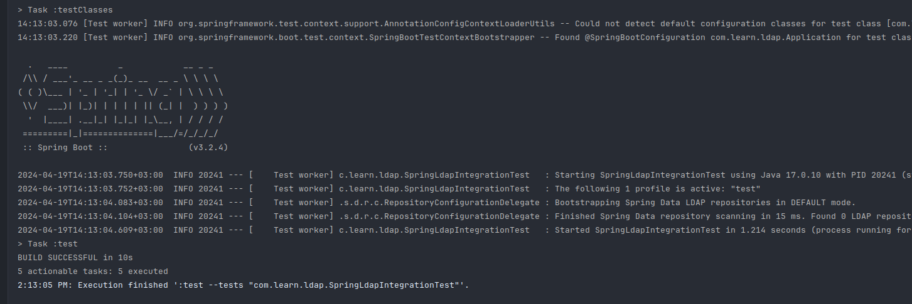

# spring-ldap-example

The project is a working build for testing LDAP locally with startup.

Not my own development, inspired by the following example ([Spring Boot + Spring LDAP Integration Testing Example](https://memorynotfound.com/spring-boot-spring-ldap-integration-testing-example/)).

I thought that maven is no longer relevant, so people should be given a working gradle test build (so that people like me don't have to struggle with it).

Java 17, Spring Boot 3.2.4, ..., gradle 7.5-all

### Preview

